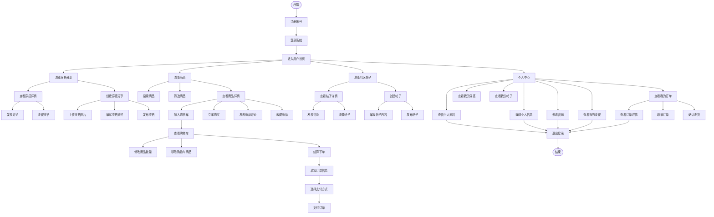

# 用户操作流程图

以下是普通用户在时尚穿搭社区平台中的操作流程图，涵盖所有核心功能。

抽离：
分享，购物：
flowchart TD
    Start([开始]) --> Register[注册账号]
    Register --> Login[登录系统]
    Login --> Home[进入用户首页]
    
    Home --> BrowseOutfits[浏览穿搭分享]
    Home --> BrowseProducts[浏览商品]

    %% 穿搭分享相关操作
    BrowseOutfits --> ViewOutfitDetail[查看穿搭详情]
    ViewOutfitDetail --> AddOutfitComment[发表评论]
    ViewOutfitDetail --> StarOutfit[收藏穿搭]
    BrowseOutfits --> CreateOutfit[创建穿搭分享]
    CreateOutfit --> UploadOutfitImage[上传穿搭图片]
    CreateOutfit --> WriteOutfitDesc[编写穿搭描述]
    CreateOutfit --> PublishOutfit[发布穿搭]
    
    %% 商品相关操作
    BrowseProducts --> SearchProducts[搜索商品]
    BrowseProducts --> FilterProducts[筛选商品]
    BrowseProducts --> ViewProductDetail[查看商品详情]
    ViewProductDetail --> AddToCart[加入购物车]
    ViewProductDetail --> BuyNow[立即购买]
    ViewProductDetail --> AddProductReview[发表商品评价]
    ViewProductDetail --> StarProduct[收藏商品]
    
    %% 购物车相关操作
    AddToCart --> ViewCart[查看购物车]
    ViewCart --> UpdateQuantity[修改商品数量]
    ViewCart --> RemoveFromCart[移除购物车商品]
    ViewCart --> Checkout[结算下单]
    Checkout --> FillOrderInfo[填写订单信息]
    FillOrderInfo --> SelectPayment[选择支付方式]
    SelectPayment --> PayOrder[支付订单]
    
 
 
