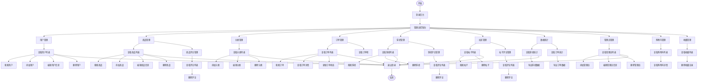

# 管理员操作流程图

以下是管理员在时尚穿搭社区平台中的操作流程图，涵盖所有管理功能。

```mermaid
flowchart TD
    Start([开始]) --> Login[登录后台]
    Login --> AdminDashboard[管理员控制台]
    
    AdminDashboard --> UserManagement[用户管理]
    AdminDashboard --> ProductManagement[商品管理]
    AdminDashboard --> CategoryManagement[分类管理]
    AdminDashboard --> OrderManagement[订单管理]
    AdminDashboard --> OutfitManagement[穿搭管理]
    AdminDashboard --> ForumManagement[社区管理]
    AdminDashboard --> StatsManagement[数据统计]
    AdminDashboard --> AdminManagement[管理员管理]
    
    %% 用户管理相关操作
    UserManagement --> ViewUserList[查看用户列表]
    ViewUserList --> SearchUsers[搜索用户]
    ViewUserList --> AddUser[添加用户]
    ViewUserList --> EditUser[编辑用户信息]
    ViewUserList --> DeleteUser[删除用户]
    
    %% 商品管理相关操作
    ProductManagement --> ViewProductList[查看商品列表]
    ViewProductList --> SearchProducts[搜索商品]
    ViewProductList --> AddProduct[添加商品]
    ViewProductList --> EditProduct[编辑商品信息]
    ViewProductList --> DeleteProduct[删除商品]
    ProductManagement --> ReviewManagement[商品评论管理]
    ReviewManagement --> ViewReviewList[查看评论列表]
    ViewReviewList --> DeleteReview[删除评论]
    
    %% 分类管理相关操作
    CategoryManagement --> ViewCategoryList[查看分类列表]
    ViewCategoryList --> AddCategory[添加分类]
    ViewCategoryList --> EditCategory[编辑分类]
    ViewCategoryList --> DeleteCategory[删除分类]
    
    %% 订单管理相关操作
    OrderManagement --> ViewOrderList[查看订单列表]
    ViewOrderList --> SearchOrders[搜索订单]
    ViewOrderList --> ViewOrderDetail[查看订单详情]
    ViewOrderList --> UpdateOrderStatus[更新订单状态]
    OrderManagement --> ViewOrderItems[查看订单项]
    
    %% 穿搭管理相关操作
    OutfitManagement --> ViewOutfitList[查看穿搭列表]
    ViewOutfitList --> SearchOutfits[搜索穿搭]
    ViewOutfitList --> DeleteOutfit[删除穿搭]
    OutfitManagement --> DiscussManagement[穿搭评论管理]
    DiscussManagement --> ViewDiscussList[查看评论列表]
    ViewDiscussList --> DeleteDiscuss[删除评论]
    
    %% 社区管理相关操作
    ForumManagement --> ViewForumList[查看帖子列表]
    ViewForumList --> SearchPosts[搜索帖子]
    ViewForumList --> DeletePost[删除帖子]
    ForumManagement --> CommentManagement[帖子评论管理]
    CommentManagement --> ViewCommentList[查看评论列表]
    ViewCommentList --> DeleteComment[删除评论]
    
    %% 数据统计相关操作
    StatsManagement --> ViewOutfitStats[查看穿搭统计]
    StatsManagement --> ViewOrderStats[查看订单统计]
    ViewOutfitStats --> ExportOutfitData[导出穿搭数据]
    ViewOrderStats --> ExportOrderData[导出订单数据]
    
    %% 管理员管理相关操作
    AdminManagement --> ViewAdminList[查看管理员列表]
    ViewAdminList --> AddAdmin[添加管理员]
    ViewAdminList --> EditAdmin[编辑管理员信息]
    ViewAdminList --> DeleteAdmin[删除管理员]
    
    %% 购物车管理
    AdminDashboard --> CartManagement[购物车管理]
    CartManagement --> ViewCartList[查看购物车列表]
    ViewCartList --> ViewCartDetail[查看购物车详情]
    
    %% 收藏管理
    AdminDashboard --> StarManagement[收藏管理]
    StarManagement --> ViewStarsList[查看收藏列表]
    ViewStarsList --> DeleteStar[删除收藏记录]
    
    %% 结束流程
    ViewUserList --> Logout[退出登录]
    ViewProductList --> Logout
    ViewCategoryList --> Logout
    ViewOrderList --> Logout
    ViewOutfitList --> Logout
    ViewForumList --> Logout
    ViewOutfitStats --> Logout
    ViewAdminList --> Logout
    
    Logout --> End([结束])
``` 