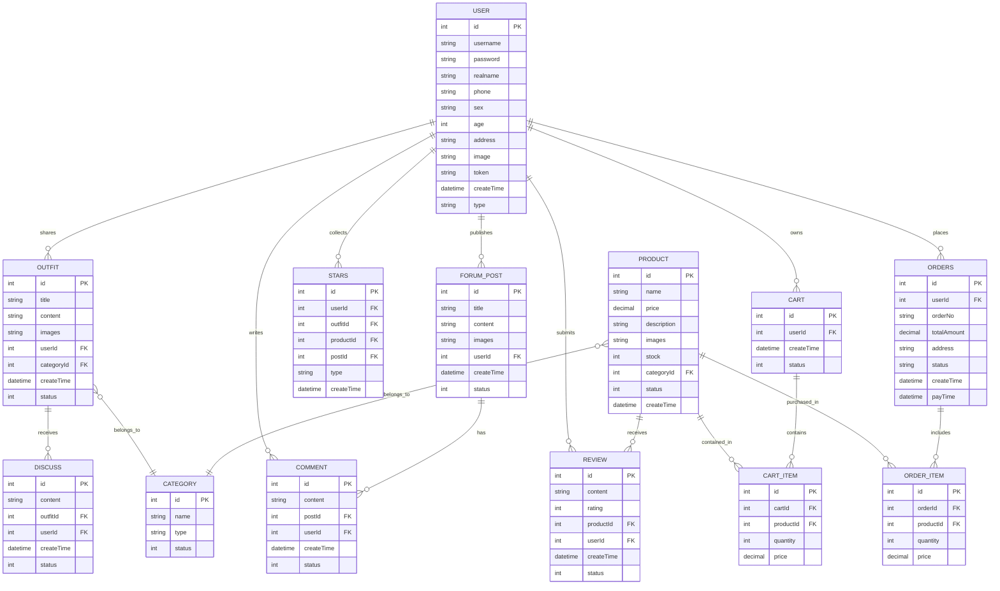

# 时尚穿搭社区系统

## 系统摘要

随着互联网的快速发展，社交媒体与电子商务的结合已成为当前网络应用的主流趋势。人们通过互联网不仅可以进行信息交流，还能实现购物、分享等多样化需求。时尚穿搭作为人们日常生活中的重要组成部分，对在线平台提出了集分享、互动和购物于一体的综合性需求。

本系统基于Vue2框架开发，结合Element UI组件库构建了一个现代化的时尚穿搭社区平台。系统采用前后端分离架构，前端通过Axios进行HTTP请求，实现与后端API的数据交互。系统设计轻量化的数据缓存机制，优先从内存缓存获取用户信息，减少本地存储访问，提升响应速度和用户体验。

系统实现了用户穿搭分享、商品展示与购买、社区互动等核心功能，并针对不同用户角色（普通用户、管理员）提供差异化的功能界面。通过路由守卫机制确保系统访问安全，管理员功能需验证登录状态才能访问。同时，系统支持组件懒加载，减少初始加载时间，提高页面响应速度。

该系统为用户提供了一站式时尚穿搭分享与购物体验，满足了现代年轻人对时尚社交和网络购物的需求，实现了社交媒体与电子商务的有机结合。

## 系统活动图

## 数据库ER图

